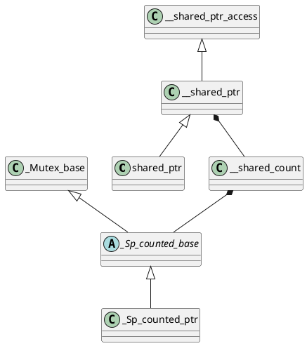

```plantuml
@startuml
class shared_ptr
class __shared_ptr
class __shared_ptr_access
class __shared_count
abstract class _Sp_counted_base
class _Sp_counted_ptr
class _Mutex_base

__shared_ptr <|-- shared_ptr
__shared_ptr_access<|-- __shared_ptr
__shared_ptr *-- __shared_count
__shared_count *-- _Sp_counted_base
_Mutex_base <|-- _Sp_counted_base
_Sp_counted_base <|-- _Sp_counted_ptr
@enduml
```